# Analyse et Traitement d’Images (ATRIM)  

## 0 Digital image

Compared to the continuous image a digital representation is limited by :

- Spatial resolution (result of the sampling process)
- Color depth (resulting from the quantization process)
- Dynamic range (analog limitation of the sensor)
- Storage in memory (which often influences the sampling and
  quantization choices)  
  - [Format](https://en.wikipedia.org/wiki/Image_file_formats) of image
    - RAW
      - BMP(windows bitmap)
      - PPM, PGM, PBM, PNM: ASCII
    - Compressed
      - JPEG
      - PNG
      - TIFF
    - Vectorized
      - SVG
  - [Color Channels](https://www.w3schools.com/colors/default.asp) of image (web with interaction)

Sampling

Sample the image domain and Associate to each rectangular pixel region (x, y) from the continuous image a unique value I(x, y)  
$$
\begin{array}{ll}
\mathcal{I}: \Omega \subset \mathbb{R}^{2} & \rightarrow & \mathbb{R} \\
(x,y) & \rightarrow & \mathcal{I}(x,y)\\
\end{array}
$$
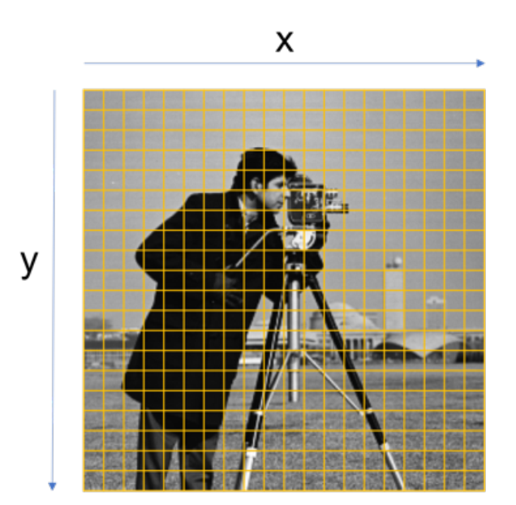

Dynamic range (DR)

Determines the relation between the min and max values in the measured physical quantity that the sensor can capture.  

Many scenes have higher DR than conventional image sensors  

- Human eye dynamic range around 90dB  
- Natural scenes can have a large dynamic range > 10^5 (100dB)  

Because of their limited dynamic range of digital cameras they may not capture all the light variations (contrast) with a single exposure.  

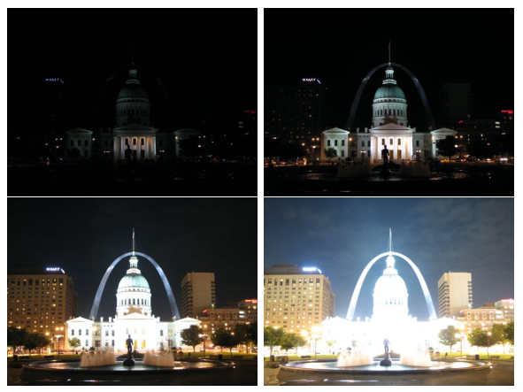

Quantization

The quantization is a discretization of the function’s range(see below)

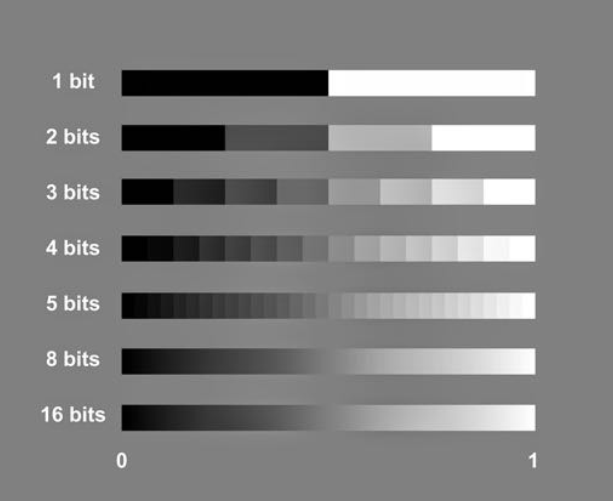

So Color depth :
Standard Monitors  : 8 bits(1 byte)/color_channel/pixel = 3 byte/pixel (RGB)

### Properties of image

Luminance

- Grayscale images : $L(\mathcal{I})=\operatorname{mean}(\mathcal{I})=\frac{1}{N M} \sum_{y=1}^{M} \sum_{x=1}^{N} \mathcal{I}(x, y)$
- RGB color images : $L(\mathcal{I})=a*\text{Red}(\mathcal{I})+b*\text{Green}(\mathcal{I}) + c*\text{Blue}(\mathcal{I}) \text{, } a+b+c = 1$
  $L(\mathcal{I})=0.3086*\text{Red}(\mathcal{I})+0.6094*\text{Green}(\mathcal{I}) + 0.0820*\text{Blue}(\mathcal{I})$
  $L(\mathcal{I})=0.299*\text{Red}(\mathcal{I})+0.587*\text{Green}(\mathcal{I}) + 0.114 *\text{Blue}(\mathcal{I})$

Contrast

- The maximum contrast of an image is given by the dynamic range  
- $C_{1}(\mathcal{I})=\frac{\operatorname{max}(\mathcal{I})-\operatorname{min}(\mathcal{I})}{\operatorname{max}(\mathcal{I})+\operatorname{min}(\mathcal{I})}$
  $C_{2}(\mathcal{I})=\sqrt{\frac{1}{M N} \sum_{y=1}^{M} \sum_{x=1}^{N}(\mathcal{I}(x, y)-L)^{2}}$

Acutance and Sharpness

- Related to the amplitude of the derivative of brightness.
- Acutance is a subjective perception of sharpness related to the edge contrast of an image
- Perceived sharpness is a combination of both resolution and acutance  

Signal to Noise Ratio (SNR)

- Usually measured in dB $= 10log_{10}(SNR)$
- $S N R_{1}=\frac{P_{\text {signal }}}{P_{\text {noise }}} P:$ power
  $S N R_{2}=\frac{\sigma_{\text {signal }}^{2}}{\sigma_{\text {noise }}^{2}}$ if variances $\sigma$ available
  $S N R_{2}=\frac{A_{\text {signal }}^{2}}{A_{\text {noise }}^{2}}$ with $A$ the RMS amplitude
- For images: 
  Average of signal ratio variance of bg: $S N R_{4}=\frac{\mu_{\text {signal }}}{\sigma_{\text {background }}}$
  But for example high contrast black bg image, $\sigma_{\text {background }} \rightarrow 0$, so we use this : $S N R_{5}=\frac{\mu_{\text {signal }}}{\sigma_{\text {signal }}}$

Histogram

- the frequency of different gray levels in the image  
- 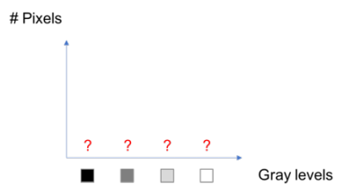 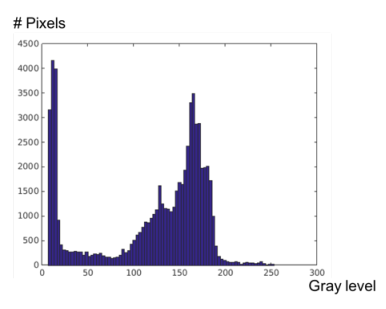
- $\begin{aligned}
  & h[k]=\sum_{y=1}^{M} \sum_{x=1}^{N} \delta(\mathcal{I}(x, y)-k), \text { where } \delta(n)= \begin{cases}1 & \text { if } \quad n=0 \\
  0 & \text { else }\end{cases} \\
  & k \in\{0,1,2, \ldots, Q-1\} \text{ represent gray level}
  \end{aligned}$

### Image processing 

> HSV color
>
> - Hue（色调、色相）:  0 ~360°
>   - Hue(Red)=0, Hue(Green)=120, Hue(Blue)=240
> - Saturation（饱和度、色彩纯净度）: 0~100%
>   - S = 0 is white(gray)
> - Value（明度）: 0~100%
>   - V = 0 is black
>
> 

> Example of Image Processing: [Revealing Invisible Changes In The World](https://www.youtube.com/watch?v=e9ASH8IBJ2U)

Types of transformation

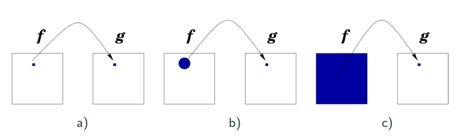

- a. Pointwise: $g = ax+b$
  - change brightness or saturation
  - color transformation
  - thresholding
- b. Local: sum一个region
  - sharpening
  - denoising
  - restoration
- c. Global: $g = \sum\sum (ax+b)$
  - compression
  - denoising  

## 1 Intensity Transformation

### Transfer function

Generally (not always) pixel-to-pixel transformations characterized by a transfer function :  $s = T(r)$

- before(horizontal axis)
  - $r$ is one of the intensity levels of the input image $r \in [0, L-1]$
- after(vertical axis) the transformation
  - $s$ is one of the intensity levels of the output image $s \in [0, L-1]$ 

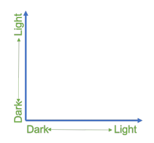 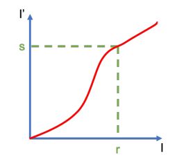

$[0, 255]$ for uint8 or $[0, 1]$ for normalized float images  
More generally, be denoted as $[0, L-1]$, with $L$ the maximum intensity 

### Types of Transformation

Linear transformation as:  $s = \alpha * r + \beta$

- Ex1: negation of image: $s = L-1-r$
  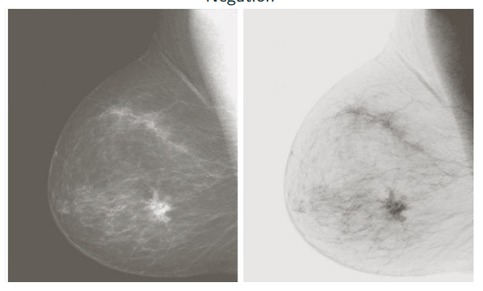
- Ex2: Normalize the histogram to get higher contrast
  $s=\frac{255}{\max (\mathcal{I})-\min (\mathcal{I})}(r-\min (\mathcal{I}))$

### Non-linear transformation

- Ex1: Contrast stretching  
  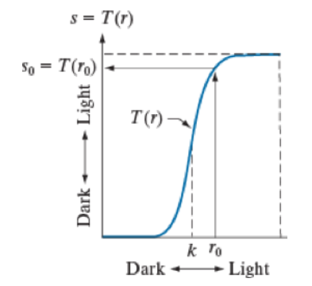 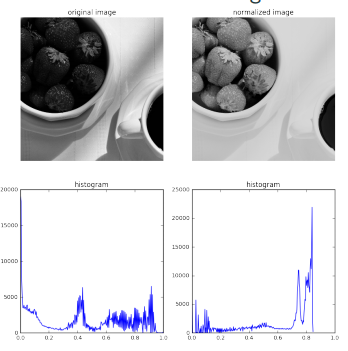
- Ex2: Thresholding  
  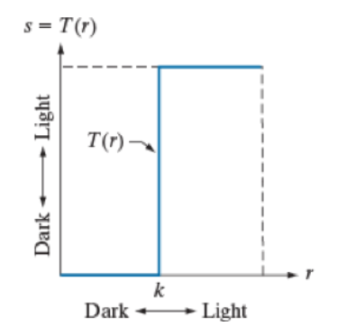 
- Ex3: Gamma correction:  $s = cr^\gamma$
  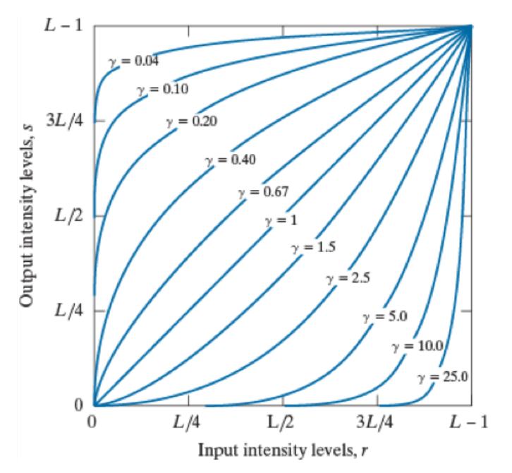 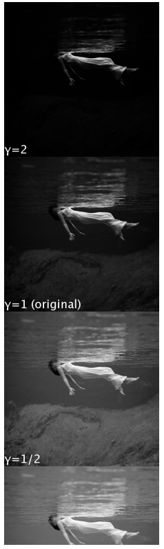
- Ex4: Log Transformation: $s=c \log (1+r)$
  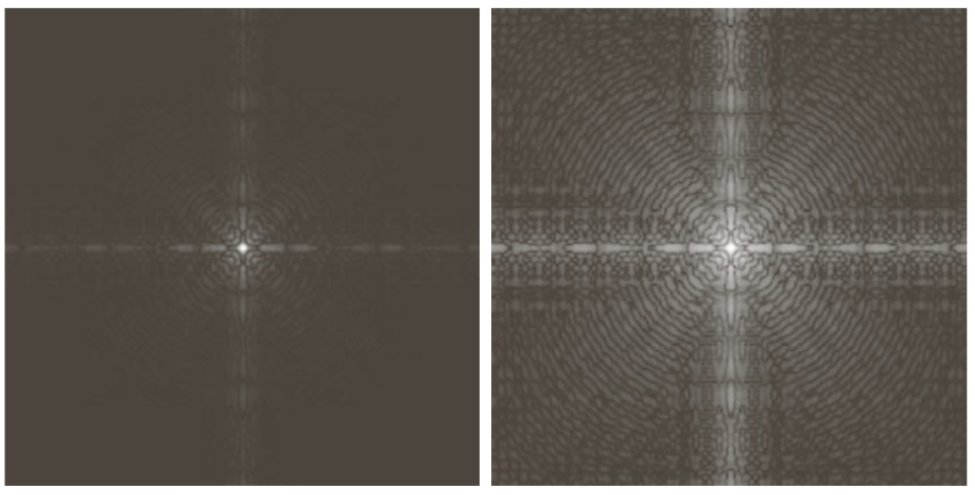

### Histogram equalization  

Idea: flatten the histogram while preserving the amount of probability density that is transferred.

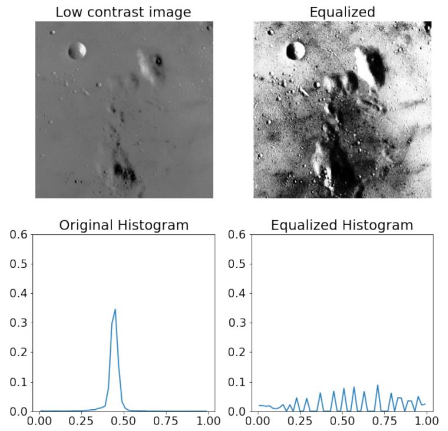 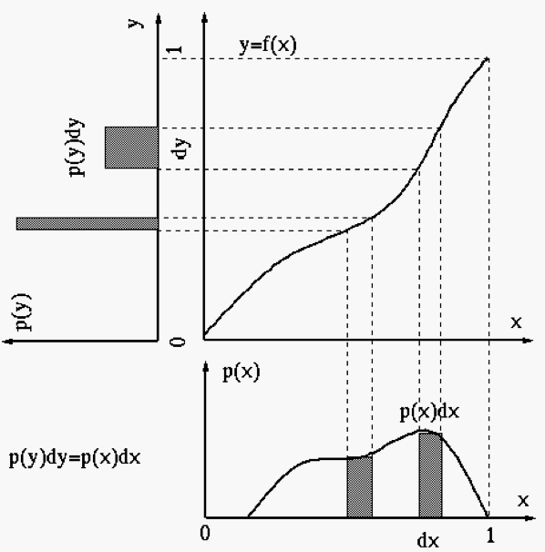

$\begin{array}{l}
\Delta s h(s) = & \Delta T(r) h(s) = h(r) \Delta r\\
\Delta T(r) = & \frac{h(r) \Delta r}{h(s)}, \text { we want constant } h(s)=\frac{1}{L-1} \\
T(r) = & (L-1) \int_{q=0}^{r} h(q) d q\\
T(r) = & (L-1) \sum_{q=0}^{r} h(q), \text{ in real}\\
\end{array}$

Disadvantage: indiscriminate (affects noise or signal in the same way)  
-> Adaptive Histogram equalization : using windows  
-> Intermediate  step of Histogram matching  
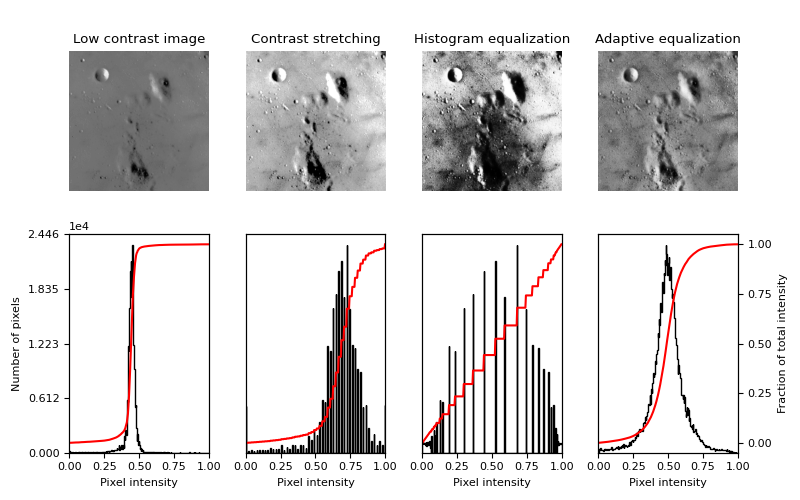

## 2 Morphological Operations

Mathematical Morphology is a framework for image processing 

- Applied to objects represented as **binary images** (generalization to
  grayscale and color images possible)  
  - Input: Object-image + Structuring element (SE)    
  - Output: Image with the **same size** of Object-image
- Useful to represent and describe the shape of regions  
  - boundaries, skeletons, convex-hull  

### Basic Operations

Erosion

- $A \ominus B=\left\{z \mid(B)_{z} \subseteq A\right\}$
- Remove small-scale details. Reduces the size of the object around the border.
- 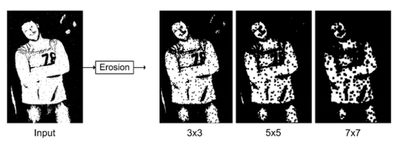

[Dilation](https://en.wikipedia.org/wiki/Dilation_(morphology)#/media/File:Grayscale_Morphological_Dilation.gif) 

- $A \oplus B=\left\{z \mid(\hat{B})_{z} \cap A \neq \emptyset\right\}$
- Fill in holes enclosed by a single region. Fill in the gap between regions, and fill boundary irregularities
- 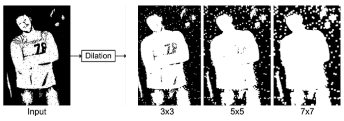

Opening

- Erosion followed by dilation 相比单纯Erosion保留了更多特征
- Eliminate small particles, break isthmus, smooth contours. 消除图像中孤立的，狭小的干扰区域（白色噪点），在纤细连接处分离物体，还会消除较大区域的凸起部分（平滑边界）
- 开运算还可以用于提取水平或竖直线：kernel是水平长条的矩形，可以提取水平线；kernel是竖直长条的矩形，可以提取竖直线。
- 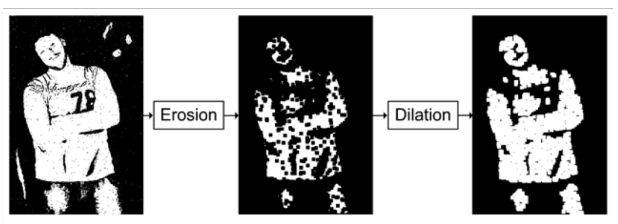

Closing

- Dilation followed by erosion 相比单纯Dilation保留了更多特征
- Fill-in holes, Fusion fractures. 用来填充物体内细小黑色空洞、连接邻近独立、分散的前景区域、多用在图像修复中。
- 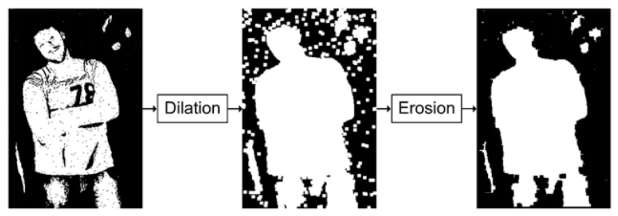

Duals w.r.t.(with reference to) set complementation and reflection  
$(A \ominus B)^{c}=A^{c} \oplus \hat{B}\\ (A \oplus B)^{c}=A^{c} \ominus \hat{B}\\$
Erosion of $A$ by $B$ is the complement of dilating $A^{c}$ with the reflected $\hat{B}$

### Combined Operations

Boundary extraction (Morphological Gradient)

- Source image - Eroded image (内部梯度)
  - $\beta(A) = A - (A \ominus B) $
- Dilated image - Source image (外部梯度)
  - $\beta(A) = (A \oplus B) - A$

- 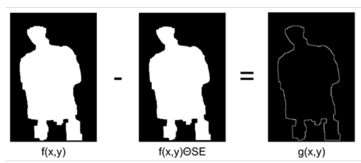

HMT - Hit-or-Miss Transformation

- Pattern detector
- $F \otimes K=\left(F \ominus K_{1}\right) \cap\left(F^{c} \ominus K_{2}\right)$
- Using the morphological [erosion](https://en.wikipedia.org/wiki/Erosion_(morphology)) operator and a pair of [disjoint](https://en.wikipedia.org/wiki/Disjoint_sets) [structuring elements](https://en.wikipedia.org/wiki/Structuring_element). The result of the hit-or-miss transform is the set of positions where the first [structuring element](https://en.wikipedia.org/wiki/Structuring_element) fits in the foreground of the input image, and the second structuring element misses it completely.

Skeletonization

- Reduces to 1 pixel wide  
- 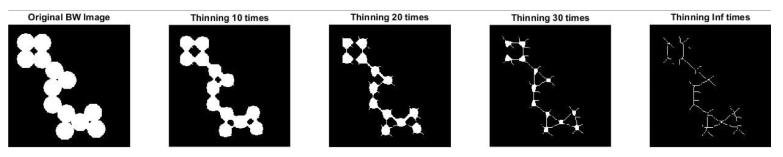
- Iterative thining process: border pixels are identified and removed on the condition that they do not break the connectivity of the corresponding object  

Convex-hul 

Hole-filling

Thickening 

## 3 Spatial filtering

> Border padding
>
> - zero padding (simple ,but 加个黑边)
> - mirror padding (边缘对称)
> - replicate the value of the nearest pixel
>

> 2 ways of degradation due to noise
>
> - sum, $g(x,y) = f(x,y) + b(x,y)$
> - multiply, $g(x,y) = f(x,y) * b(x,y)$

General linear filter: $g(x, y)=\sum_{u=-k}^{k} \sum_{v=-k}^{k} w(u, v) f(x+u, y+v)$

Transformation local !

> Correlation VS Convolution

|                    correlation                     |                    Convolution                     |
| :------------------------------------------------: | :------------------------------------------------: |
| $\sum_{u=-k}^{k} \sum_{v=-k}^{k} w(u,v)f(x+u,y+v)$ | $\sum_{u=-k}^{k} \sum_{v=-k}^{k} w(u,v)f(x-u,y-v)$ |
|                start from top left                 |                  start from bott                   |
|                 not commutative :(                 |               commutative: $f*g=g*f$               |

> 一般使用convolution，直接利用已知性质，例如: $f*\delta=f$

Principe: image - blur(image) = details

### Common linear filters  

- **Mean filter**
  - $g(x, y)=\frac{1}{(2 \cdot k+1)^{2}} \sum_{u=-k}^{k} \sum_{v=-k}^{k} f(x+u, y+v)$
- **Gaussian filter**
  - 2 dim: $w(u,v) = \frac{1}{2\pi\sigma^2}\exp(-\frac{u^2+v^2}{2\sigma^2})$
  - 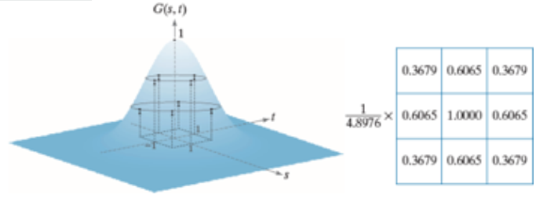
  - Used for smoother blurring and denoising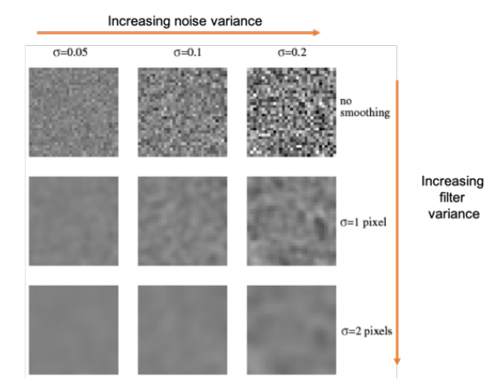

- **Unsharp Masking and highboost filtering**  

  - 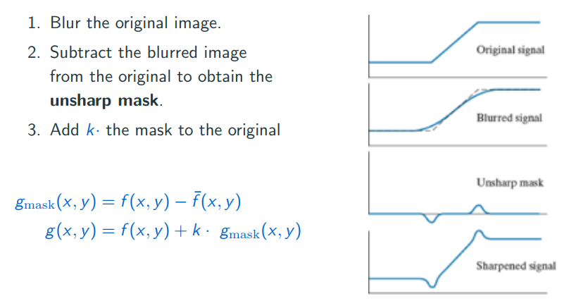
  - can blur with gaussian filter
  - point is to change k = ...?

- **Derivative filter**

  Finite differences are very sensitive to noise -> blur image first

  - **1st order Gradient**

    - 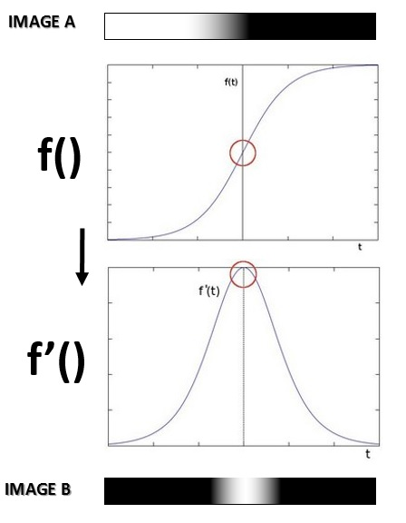

    - 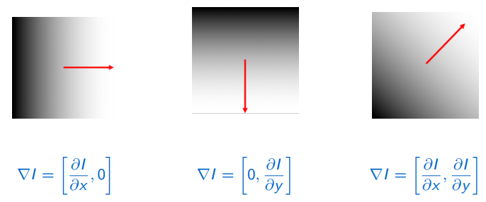

    - 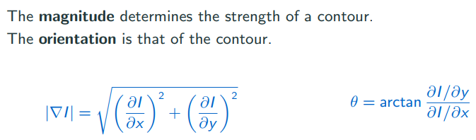

    - Sobel filters  

      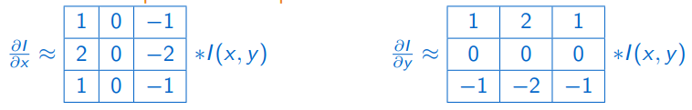

  - **2nd order Laplacian**

    - 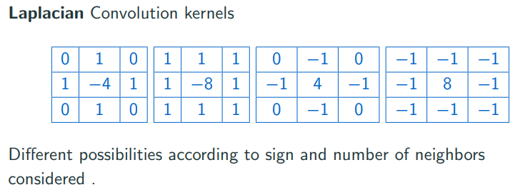

    - Laplacian for Image Sharpening : $g(x, y) = f (x, y) + c [\Delta f (x, y)]$

      c = +- 1 depends on the kernel used, the central pixel is positive then c=1

### Separability of filter

A filter is separable if the kernel rank = 1  
$g(x, y) = g_1(x)g_2(y)  $

- Take an image of size $M \rightarrow N$ and a kernel of size $m \rightarrow n$.
- The convolution requires $MNmn$ multiplications and additions.  
- If the kernel is separable, the convolution requires only $(m+n)MN$

### Advanced filtering  

- Problem with Salt and pepper noise -> breaks the linearity
  - Salt and pepper noise is characterized by random pixels being changed to salt (white) or pepper (black)  
  - Method: Replace the central pixel with the median intensity of its neighborhood 
- Edge preservation -> breaks spatial invariance  
  - Make the filter dependent on the content
  - 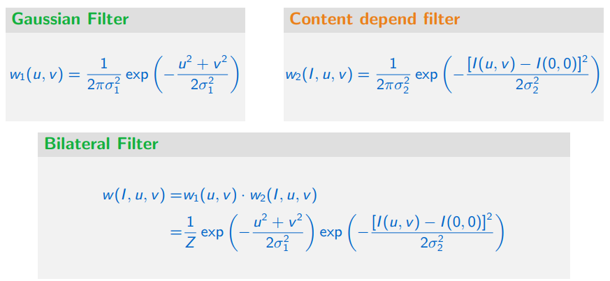
  - [Bilateral filter](https://homepages.inf.ed.ac.uk/rbf/CVonline/LOCAL_COPIES/MANDUCHI1/Bilateral_Filtering.html)  
    - Smooth and denoise while preserving contours  
    - Multiple iterations flatten the colors (cartoon effect)  
- and some others

## 4 DFT (frequency domain)

[2-Dimensional Discrete-Space Fourier Transform](https://www.youtube.com/watch?v=YYGltoYEmKo)

### Steps

1. Zero-Pad the image as twice large
2. Center the image DFT
3. Build a centered filter in frequency domain
4. Filter = multiply the DFT of the image and the filter
5. Recover the filtered image with the IDFT  

DC component = low frequency = main structure

### Different filters

- Ideal
  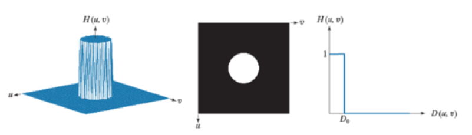

- Gaussian
  Denoising

  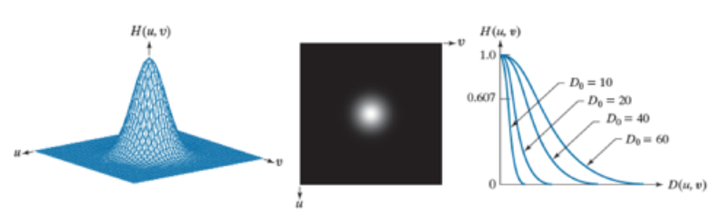

- Butterworth Filters 
  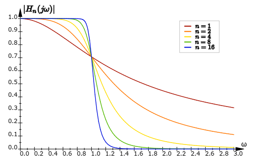

- Notch Filtering
  Removing a Moiré pattern  

Advanced filters

- Denoising - Designing the filter 
- Restoration - Inverse filtering 
- Compression  
- [Gabor Filters](https://medium.com/@anuj_shah/through-the-eyes-of-gabor-filter-17d1fdb3ac97)  
- Wavelets  (小波变换)

## 5 Segmentation

### Intensity-based methode

- Histogram-based
  - Thresholding  
  - Otsu’s method  
- Clustering-based  
  - K-means : Associate a point its closest
    center  P78
  - Expectation Maximization (EM)  

### Local region-growing methode

- Global methods  : The decision for a single pixel to belong or not to a region depends on the full-image  
- Local methods : 
  - The labeling of a pixel depends essentially from its immediate neighborhood.
  - Local algorithms facilitate integrating the topological or geometric properties of the image

Methodes

- Region growing
  - neighborhood rules  
  - growing criteria  
- Split and merge  

### Shapes and contour-based methode

Hough Transform  

Active contours without edges (Chan and Vese)  

Graph-based methods  

## 6 Geometric Transformation

- Similarity (rotation + translation + scale): preserves angles  

  $\left[\begin{array}{ccc}a \cdot \cos (\theta) & -\sin (\theta) & t_{x} \\ \sin (\theta) & a \cdot \cos (\theta) & t_{y} \\ 0 & 0 & 1\end{array}\right]\left[\begin{array}{l}x \\ y \\ 1\end{array}\right]=\left[\begin{array}{c}x^{\prime} \\ y^{\prime} \\ 1\end{array}\right]$

- Affine (rotation + translation + scale + aspect ratio + shear)  

  $\left[\begin{array}{ccc}a \cdot \cos (\theta) & -c \cdot \sin (\theta) & t_{x} \\ b \cdot \sin (\theta) & d \cdot \cos (\theta) & t_{y} \\ 0 & 0 & 1\end{array}\right]\left[\begin{array}{l}x \\ y \\ 1\end{array}\right]=\left[\begin{array}{c}x^{\prime} \\ y^{\prime} \\ 1\end{array}\right]$

- Projective

- Deformable

